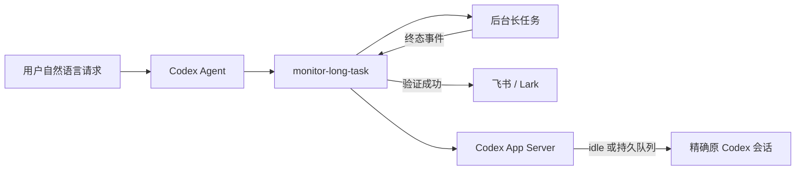

# monitor-long-task

[](https://github.com/Zita-Go/monitor-long-task/actions/workflows/ci.yml)
[](https://github.com/Zita-Go/monitor-long-task/tags)
[](https://www.python.org/)
[](LICENSE)

A Codex skill for detached long-running tasks, verified Feishu/Lark notifications, and event-driven continuation in the exact originating Codex session.

这是一个面向 Codex 的长任务 Skill：安装并配置一次后，用户只需正常描述任务。Agent 会选择监控方式、启动后台任务，并在真实终态发生时发送飞书/Lark；存在精确原线程 ID 时，默认无轮询地续接启动任务的原 Codex 会话。

## 目录

- [快速开始](#快速开始)
- [事件驱动续接原 Codex 会话](#事件驱动续接原-codex-会话)
- [Agent 如何工作](#agent-如何工作)
- [安装、更新与卸载](#安装更新与卸载)
- [创建 webhook](#创建-webhook)
- [高级 CLI 参考](#高级-cli-参考)
- [通知内容](#通知内容)
- [状态与故障排查](#状态与故障排查)
- [安全边界](#安全边界)

## 快速开始

### 1. 安装 Skill

```bash
git clone https://github.com/Zita-Go/monitor-long-task.git
cd monitor-long-task
bash scripts/install.sh
```

安装后重新加载 Codex 任务，使 Skill 列表刷新。

### 2. 只配置一次 webhook

Webhook 是凭据，不能发到聊天中。请在自己的终端运行：

```bash
MONITOR="${CODEX_HOME:-$HOME/.codex}/skills/monitor-long-task/scripts/long_task_monitor.py"
python3 "$MONITOR" configure
```

输入不会回显。配置默认保存在 `${CODEX_HOME:-$HOME/.codex}/secrets/feishu-long-task-webhook`，权限为 `0600`。

没有 webhook 时，先看[创建 webhook](#创建-webhook)。

### 3. 使用自然语言发起任务

默认行为：飞书通知并返回原会话继续处理：

```text
帮我跑完整评测，这是长任务，结束后通知我。
```

只需要飞书、不返回原会话：

```text
启动训练；结束后只发飞书，不要回原会话。
```

等待外部系统产生结果：

```text
启动导入任务并等待最终产物出现，完成后飞书通知我。
```

Agent 会自行决定项目名、摘要、超时时间以及使用 `launch` 还是 `watch`。原会话续接默认开启；用户明确要求不返回时才关闭。若任务意图不明显，也可以显式提到 `$monitor-long-task`。

成功时飞书/Lark 收到：

```text
【<项目名>】：完成<简洁结果表述>
```

例如：

```text
【demo-project】：完成TB2.1 全量评测
```

## 事件驱动续接原 Codex 会话

当长任务从 Codex 会话启动且存在精确 `CODEX_THREAD_ID` 时，Agent 默认启用原会话续接，并根据任务上下文自行编写消息。用户明确要求“只发飞书”或“不要回原会话”时才关闭。

长任务进入成功、失败或超时等终态后，worker 会先持久化续接意图和消息摘要，再连接当前 Codex App Server：

- 原线程是 `active`：表示确实有 turn 正在运行，等待正式状态事件；
- 原线程是 `idle`：立即交付，不会因为会话窗口仍打开或处于焦点而等待；
- 新版 App Server 支持 `thread/queue/*`：消息进入官方持久队列，由 App Server 在 idle 后按顺序启动；
- 较旧 App Server：订阅 `thread/status/changed`，收到目标线程的 idle 事件后才单次调用 [`codex exec resume`](https://learn.chatgpt.com/docs/developer-commands#codex-exec)。

整个判断只使用 Codex 的 `ThreadStatus`，不检查“多久没有输出”、日志时间戳或窗口焦点。健康连接会一直阻塞等待事件；App Server 重启或连接断开时才进行有上限的传输重连，并在重连时恢复订阅。

这个过程：

- 由任务终态事件直接触发；
- 不创建 Automation 或定时任务；
- 不轮询原会话状态；
- 不使用容易误选会话的 `--last`；
- 每个监控任务只接受或启动一条续接消息；
- 飞书结果、长任务结果和原会话续接结果分别记录，不互相伪装。

没有 managed App Server Unix socket 的独立 CLI 环境无法读取另一个进程中的实时状态。为了兼容旧用法，此时保留单次 `codex exec resume <原线程ID> -`，并在状态文件中明确写出 idle gate 不可用。通过 Desktop、IDE 或 managed App Server 运行时会自动使用事件驱动路径。

续接消息不是脚本写死的。Agent 可在消息中引用 `{status}`、`{summary_file}`、`{task_log}`、`{exit_code}` 和 `{error}` 等终态字段。例如：

```bash
--resume-origin-session \
--session-message '后台任务已进入 {status}。请读取 {summary_file} 和 {task_log}，基于真实结果自行继续原任务；不要重新启动该任务。'
```

续接会产生一个额外 Codex turn，消息内容由恢复后的 Agent 结合真实状态处理。该默认行为由 Skill 的 Agent 决策规则实现；脱离 Agent 直接调用底层 CLI 时，仍需显式传入 `--resume-origin-session`。缺少精确线程 ID 时，Agent 不启用续接，也绝不回退到 `--last`。协议和故障语义见 [event-driven session resume 设计](docs/event-driven-session-resume.md)。

## Agent 如何工作



普通用户不需要选择 CLI 参数。Agent 根据意图处理：

| 用户意图 | Agent 行为 | 是否轮询 |
|---|---|---|
| 托管本地构建、测试或训练命令 | 使用 `launch` 等待进程退出 | 否 |
| 等待外部任务、明确标记或最终产物 | 使用 `watch` 检查完成条件 | 是，只检查显式外部条件 |
| 一般长任务 | 默认启用原会话续接 | 否，等待正式 idle 事件 |
| 明确只发飞书、不要回原会话 | 不启用原会话续接 | 不涉及 |
| 要求结束后继续分析或汇总 | 启用原会话续接 | 否，等待正式 idle 事件 |
| 普通短命令 | 不使用该 Skill | 不涉及 |

默认行为：

- 飞书/Lark 只在验证成功后发送；失败和超时不伪装成“完成”。
- 存在精确 `CODEX_THREAD_ID` 时，原会话续接默认开启；用户明确要求不返回时关闭。
- 原会话续接本身从不轮询；`watch` 只服务于无法直接托管的外部条件。
- 后台 worker 独立运行，不占用 Agent 等待；Agent 可以继续完成其他不依赖长任务结果的工作。
- 超时不会自动杀死仍在运行的真实任务。

## 安装、更新与卸载

### 要求

- Python 3.10 或更高版本
- Codex CLI、IDE 或 Desktop 的本地执行环境
- Linux 或 macOS；Windows 后台进程行为尚未验证
- 可访问飞书或 Lark 自定义机器人 webhook

Skill 按 Codex host 安装。使用多个远程主机时，需要在每台实际运行任务的主机上分别安装；webhook 和任务状态也各自保存在该主机的 `CODEX_HOME` 中。

### 安装

```bash
git clone https://github.com/Zita-Go/monitor-long-task.git
cd monitor-long-task
bash scripts/install.sh
```

也可以直接告诉 Codex：

```text
请从 https://github.com/Zita-Go/monitor-long-task 的
skills/monitor-long-task 路径安装 monitor-long-task Skill。
```

安装器不会覆盖已有 Skill。

### 更新

```bash
cd monitor-long-task
git pull --ff-only
bash scripts/install.sh --update
```

更新前的 Skill 会移动到：

```text
${CODEX_HOME:-$HOME/.codex}/skills/.backups/monitor-long-task-<UTC时间>
```

Webhook 和 `long-task-monitors/` 状态目录不会被修改。

### 可恢复卸载

```bash
bash scripts/install.sh --uninstall
```

安装器不会直接删除 Skill，而是将其移动到 `skills/.disabled/`。Webhook 和历史状态仍会保留，方便恢复或审计。

查看所有选项：

```bash
bash scripts/install.sh --help
```

## 创建 webhook

本项目使用群聊中的“自定义机器人”入站 webhook，不需要创建企业自建应用。

1. 新建或打开一个用于接收通知的群聊。
2. 在群设置中进入“群机器人”或“机器人”，选择“添加机器人”。
3. 选择“自定义机器人”，填写名称，例如 `Codex Long Task Monitor`。
4. 配置安全策略：
   - 简单场景：启用关键词校验并填写 `完成`；所有成功消息都包含这个词。
   - 有固定公网出口时：可以使用 IP 白名单。
   - 当前版本不生成签名参数，不要启用签名校验。
5. 创建机器人并复制 webhook 地址。

飞书格式：

```text
https://open.feishu.cn/open-apis/bot/v2/hook/xxxxxxxx-xxxx-xxxx-xxxx-xxxxxxxxxxxx
```

Lark 使用 `open.larksuite.com`。界面和安全设置以官方文档为准：[飞书自定义机器人](https://open.feishu.cn/document/client-docs/bot-v3/add-custom-bot)、[Lark Custom Bot](https://open.larksuite.com/document/client-docs/bot-v3/add-custom-bot)。

运行交互式配置命令：

```bash
MONITOR="${CODEX_HOME:-$HOME/.codex}/skills/monitor-long-task/scripts/long_task_monitor.py"
python3 "$MONITOR" configure
```

使用 `configure --force` 可以替换现有地址。不要把真实 webhook 放进命令参数、聊天内容、Issue 或 Git 历史；地址泄露后应立即重新生成。

### 可选：验证 webhook

普通使用无需运行测试命令。排查安装时，可以执行：

```bash
python3 "$MONITOR" launch \
  --project "monitor-long-task" \
  --summary "Webhook 联调" \
  --cwd "$PWD" \
  --timeout-minutes 1 \
  -- true
```

## 高级 CLI 参考

以下命令主要供 Agent、集成开发和故障排查使用。

```bash
MONITOR="${CODEX_HOME:-$HOME/.codex}/skills/monitor-long-task/scripts/long_task_monitor.py"
```

### `launch`：托管前台命令

```bash
python3 "$MONITOR" launch \
  --project "demo-project" \
  --summary "全量测试" \
  --cwd "/absolute/path/to/demo-project" \
  --timeout-minutes 240 \
  -- python3 -m unittest discover -v
```

被托管命令应保持前台运行。退出码为 `0` 才视为成功；会自行 daemonize 的程序应改用 `watch`。

### 原会话续接参数

Agent 启用续接时会附加：

```bash
--resume-origin-session \
--origin-thread-id "$CODEX_THREAD_ID" \
--session-message '<由 Agent 根据任务上下文编写的消息>'
```

`--session-idle-timeout-minutes` 控制等待原线程 idle 的最长时间，默认 1440 分钟。`--app-server-socket` 只用于自定义 managed App Server socket；通常无需设置。脚本会在创建监控任务时记录该 socket 是否可用，普通用户不需要选择事件模式或队列模式。

### `watch`：检查外部完成条件

```bash
python3 "$MONITOR" watch \
  --project "demo-project" \
  --summary "模型训练" \
  --cwd "/absolute/path/to/demo-project" \
  --interval-seconds 30 \
  --timeout-minutes 720 \
  -- sh -lc 'test -s artifacts/final_model/config.json'
```

`watch` 是唯一主动轮询模式。检查命令必须只读、幂等，并且仅在目标真实达成时返回 `0`。

### 查看状态

```bash
python3 "$MONITOR" status <task_id>
python3 "$MONITOR" list --limit 20
python3 "$MONITOR" retry-notification <task_id>
```

## 通知内容

监控器不会因为 Agent 当前回合结束就发送消息。只有 `launch` 命令退出码为 `0`，或 `watch` 完成检查返回 `0` 后才发送纯文本：

```text
【<项目名>】：完成<简洁结果表述>
```

- `<项目名>` 来自 `--project`；省略时从 Git 根目录名或 `--cwd` 推断。
- `<简洁结果表述>` 来自 `--summary`；脚本会去掉重复的“完成”前缀、合并空白，并限制为 80 个字符。

Webhook payload：

```json
{
  "msg_type": "text",
  "content": {
    "text": "【demo-project】：完成全量测试"
  }
}
```

通知不包含命令、日志、工作目录、原始用户提示或 webhook。`failed`、`start_failed`、`monitor_failed` 和 `timed_out` 不发送“完成”；`completed_notification_failed` 表示任务成功但消息未送达，可以执行 `retry-notification`。

## 状态与故障排查

状态默认保存在：

```text
${CODEX_HOME:-$HOME/.codex}/long-task-monitors/<task_id>/
```

| 状态 | 含义 |
|---|---|
| `completed` | 任务成功且飞书/Lark 已发送 |
| `completed_notification_failed` | 任务成功，但飞书/Lark 未送达 |
| `failed` | 被托管命令返回非零退出码 |
| `start_failed` | 无法启动被托管命令 |
| `monitor_failed` | 监控器自身失败 |
| `timed_out` | 监控超时；实际任务不会被自动终止 |

`origin_session_resume` 独立记录续接状态：

| 续接状态 | 含义 |
|---|---|
| `waiting_for_idle` | 消息摘要已持久化，正在连接 App Server 或等待目标线程 idle 事件 |
| `queued` | App Server 持久队列已接受消息，将在目标线程 idle 后启动 |
| `dispatched` | 兼容路径已确认 idle 并启动一次 `codex exec resume`，或在无 idle gate 环境中执行单次兼容派发 |
| `failed` | 等待超时、线程 `systemError`、协议错误或续接进程无法启动 |

关键文件：

| 文件 | 用途 |
|---|---|
| `state.json` | 最新结构化状态 |
| `summary.json` | 终态摘要 |
| `task.log` | 被托管命令或检查命令输出 |
| `monitor.log` | 后台 worker 自身日志 |
| `session-resume.log` | `codex exec resume` 兼容路径的输出；持久队列路径可能不创建此文件 |

### 飞书错误

| 错误码 | 含义 | 处理方式 |
|---|---|---|
| `19001` | webhook 无效 | 重新复制机器人 webhook |
| `19024` | 缺少安全关键词 | 将关键词设为 `完成`，或调整安全策略 |
| `19022` | 来源 IP 不在白名单 | 加入真实出口 IP，或改用关键词校验 |
| `19021` | 签名不匹配 | 当前版本应关闭签名校验 |

### 原会话没有恢复

- `origin thread id is required`：当前环境没有 `CODEX_THREAD_ID`；可以不启用续接，或显式传入 `--origin-thread-id <UUID>`。
- `codex binary was not found`：确认 `codex` 位于 `PATH`，或传入 `--codex-binary /absolute/path/to/codex`。
- `origin_session_resume.status=waiting_for_idle`：原线程仍是 `active`，或 App Server 正在重连；打开但没有运行 turn 的会话不会停在这里。
- `origin_session_resume.status=queued`：消息已由 App Server 持久接收，不需要再手动执行 resume。
- `origin_session_resume.status=dispatched` 只表示续接进程已启动；最终 CLI 错误查看 `session-resume.log`。
- `origin_session_resume.status=failed`：查看其中的 `error`；长任务和飞书通知的状态仍以顶层字段为准。
- `idle_gate.mode=unavailable`：创建监控任务时没有 managed App Server Unix socket，已使用独立 CLI 的单次兼容路径，无法提供跨进程 active/idle 保证。

### 安装或更新失败

- 已安装时再次执行默认安装会拒绝覆盖；使用 `--update`。
- 更新会先完整 staging 新版本，再移动旧版本；失败时尽可能恢复旧 Skill。
- 安装器不会修改 webhook 和长任务状态目录。

## 安全边界

- Webhook 文件必须是普通文件，权限不得宽于 `0600`。
- 只接受官方 `open.feishu.cn` 或 `open.larksuite.com` 机器人地址。
- Webhook 不会写入任务状态或日志。
- 命令与会话消息模板保存在权限为 `0600` 的 `request.json`；不要把凭据放进参数或模板。
- 超时只停止监控等待，不会擅自杀死实际任务。
- 原会话续接使用精确 UUID；绝不以“最近会话”代替。

## 开发与验证

```bash
python3 -W error::ResourceWarning -m unittest discover -s tests -v
python3 -m compileall -q skills tests
bash -n scripts/install.sh
```

Skill 元数据还可以使用 Codex 自带的 `skill-creator/scripts/quick_validate.py` 校验。

## License

[MIT](LICENSE)
